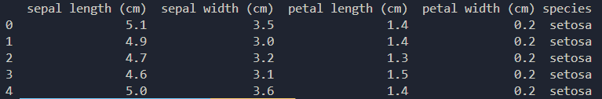
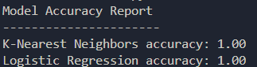
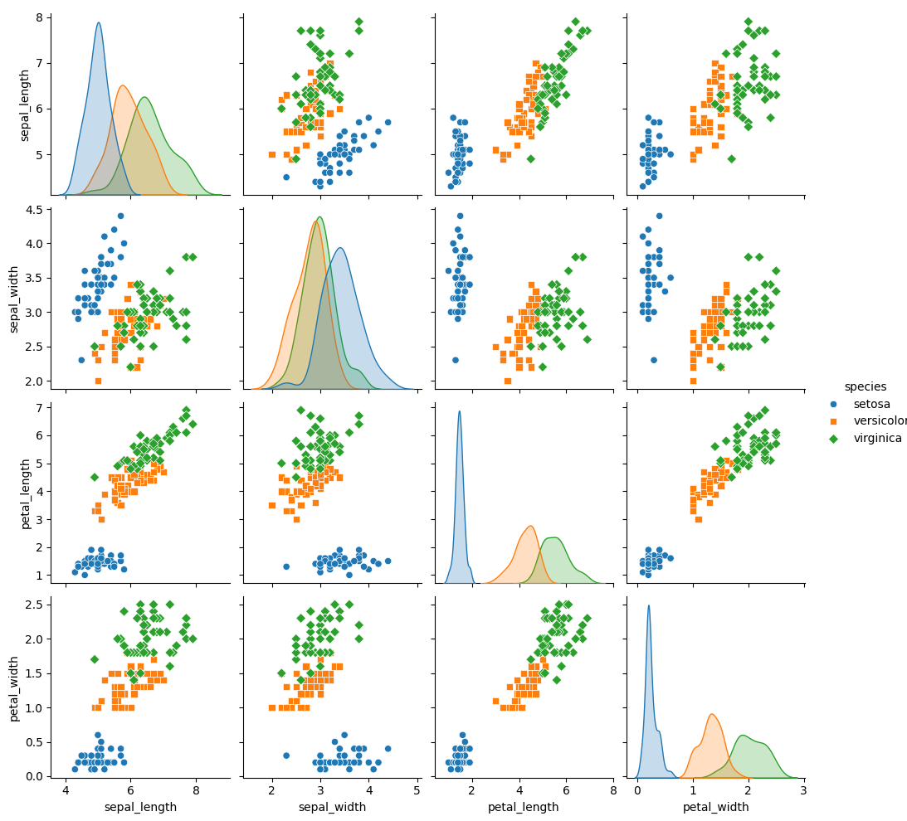
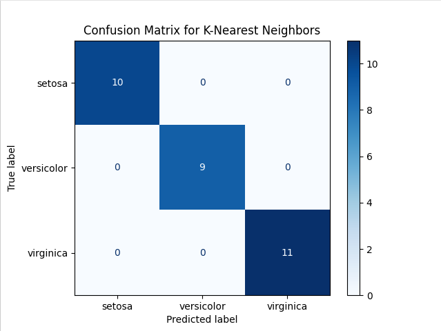

# Task 18: Iris Species Classification Model

## Short description

Participants are required to develop a machine learning model to classify iris species based on measurements of their sepals and petals using the Iris dataset. The objective is to apply data processing, model training, and evaluation techniques to predict the species with high accuracy.
Develop a machine learning model to classify iris species using the Iris dataset.

## Expected Sequence of Steps

**Step 1: Data preprocessing**

- Load the Iris dataset from scikit-learn.
- Perform data cleaning, preprocessing, or normalization (if necessary).
- Split the dataset into a training set and a testing set.

**Step 2: Model Selection**

- Choose at least two different machine learning algorithms to train your model. Suggested algorithms include Logistic Regression, K-Nearest Neighbors, Support Vector Machine, or Decision Tree.
- Evaluate the pros and cons of each selected algorithm in the context of the Iris dataset.

**Step 3: Model Training and Evaluation**

- Train your model using the training data.
- Evaluate the accuracy of each model on the test data.
- Select the model that performs the best.

**Step 4: Model Evaluation**

- Create visualizations to show the distribution of the different features of the iris species.
- Plot the decision boundaries of your model, if applicable.

## Input Data

The Iris dataset is a foundational dataset used in statistical learning and machine learning for classification tasks. It consists of 150 samples of iris flowers, equally distributed among three species: Iris Setosa, Iris Versicolor, and Iris Virginica. Each sample has four features measured in centimeters, which describe the physical dimensions of the flowers.

### Dataset Composition

- Number of Instances: 150
- Number of Attributes: 4 numeric, predictive attributes and the class
- Attribute Information:
  - Sepal Length (cm): The length of the sepal (outer part of the flower).
  - Sepal Width (cm): The width of the sepal.
  - Petal Length (cm): The length of the petal (inner part of the flower).
  - Petal Width (cm): The width of the petal.
- Class Labels:
  - Setosa: Iris Setosa species.
  - Versicolor: Iris Versicolor species.
  - Virginica: Iris Virginica species.
- Data Format: csv



### Data Source

Data is available in sklearn datasets
**Access Code Snippet:**

```python
from sklearn.datasets import load_iris
data = load_iris()
X, y = data.data, data.target
```

### Solution development

All the code should be put inside the `solution.py` file.

Please replace `### PUT YOUR CODE HERE` with the final implementation

The code should be executable, as there are implemented some unit tests, that will be running
against implemented method.

Code should include at least two functions - `preprocess_data` (loading data, splitting data into training and test), `train_model` (training of model).

### Expected Outputs

Participants are expected to produce a machine learning model capable of classifying iris species based on their sepal and petal measurements. The outputs should demonstrate not only the effectiveness of the model through accuracy metrics but also provide insights into the data and the model's decision-making process through visualizations.

# Output Format

- Model Accuracy Report (A textual summary that includes the accuracy scores of the models tested, ideally presented in a tabulated format within the Python script.)



- Feature Distribution Visualizations (Pair plots or scatter plots showing the relationships and distributions of features by species. These should use different colors or markers for different iris species to aid in visual distinction.)



- Model Decision Boundaries (Visual plots illustrating the decision boundaries determined by the models. For models where such a visualization is feasible (e.g., K-Nearest Neighbors, Decision Trees), provide plots showing how the model classifies different regions of the feature space.)
- Confusion Matrix (A confusion matrix for each model to illustrate the true positives, true negatives, false positives, and false negatives. This can help in understanding how well the model is performing with respect to each class.)


